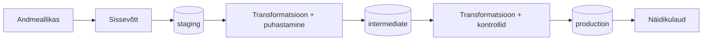

# POI — Huviväärsuste andmebaasi ajakohasena hoidmine vabaandmete abil

## Äriküsimus

Ärivajadus on hoida avaandmete (näidisandmekoguks jäätmekäitluskohade register) põhised huvipunktide andmed ettevõtte POI andmebaasis maksimaalselt ajakohasena võimalikult vähese käsitööga. Lahendus peab lisaks sisestusvalmis muudatuste ette valmistamisele andma ülevaate nende käsitlemise seisust, et spetsialist saaks hinnata töömahtu, andmete ajakohasust ja andmehoolduse prioriteete.

**Mõõdikud:**

1. **Lahendamata muudatuste arv ja osakaal**  
Näitab, mitu jäätmekäitlusregistri objekti on tuvastatud POI andmebaasi jaoks uue, muutunud või eemaldatud objektina, kuid ei ole veel sihtandmebaasis käsitletud.

2. **Lahendamata muudatuste jaotus tüübi järgi**  
Näitab, kas lahendamata muudatused on seotud lisandunud objektide, eemaldatud objektide, atribuudimuutuste või asukohamuutustega.

3. **Lahendamata muudatuste ruumiline paiknemine**  
Näitab kaardil, kus lahendamata muudatused paiknevad, et spetsialist saaks hinnata töö piirkondlikku jaotust ja prioriteetsust. Mõõdik lisatakse juhul, kui projekti ajakava seda võimaldab.

## Arhitektuur



Täpsem kirjeldus: [`docs/arhitektuur.md`](docs/arhitektuur.md)  


## Andmestik

| Allikas | Tüüp | Ajas muutuv? | Roll |
|---------|------|--------------|------|
| [Jäätmekäitluskohtade register](https://keskkonnaandmed.envir.ee/f_jkkregister_curr) | Avalik PostgREST/JSON API | Jah, uueneb jooksvalt | Peamine andmeallikas |
| Algne POI ja JKKR seoste tabel | CSV (ühekordne algseadistuse tabel) | Ei, staatiline | Olemasolevate registriobjektide sidumine POI andmebaasiga |

## Stack

| Komponent | Tööriist |
|-----------|---------|
| Sissevõtt | Python |
| Transformatsioon | PostgreSQL protseduurid (SQL) |
| Andmehoidla | PostgreSQL/PostGIS |
| Näidikulaud | Metabase |
| Orkestreerimine | Airflow |
| Keskkond | Docker Compose |

## Käivitamine

```bash
# 1. Klooni repo ja liigu kausta
git clone <repo-url>
cd <projekti-kaust>

# 2. Kopeeri keskkonnamuutujad
cp .env.example .env
# Muuda .env failis paroolid ja muud seaded vastavalt vajadusele

# 3. Käivita teenused
docker compose up -d --build

# 4. Käivita pipeline käsitsi (või oota öist Airflow automaatset käivitust)
docker exec poi-upd-airflow-scheduler \
    airflow dags trigger jkk-poi-upd-pipeline
```

Airflow: http://localhost:8080
Metabase: http://localhost:3001

Täpsem kirjeldus: JUHEND.md

## Saladused ja konfiguratsioon

Kõik saladused (paroolid, API võtmed, andmebaasi URL-id) on `.env` failis. Repos on ainult `.env.example`, mis näitab vajalike muutujate struktuuri ilma tegelike väärtusteta. Päris `.env` faili ei tohi GitHubi panna - see on `.gitignore`-s.

Vajalikud muutujad:

| Muutuja | Tähendus |
|---------|----------|
| `POSTGRES_PASSWORD` | PostgreSQL parool |
| `PGADMIN_DEFAULT_PASSWORD` | pgAdmin parool |
| `AIRFLOW_PASSWORD` | Airflow metaandmebaasi parool |
| `_AIRFLOW_WWW_USER_PASSWORD` | Airflow parool |
| `MB_DB_PASS` | Metabase metaandmebaasi parool |

## Andmevoog lühidalt

1. **Sissevõtt** — Airflow DAG `jkk-poi-upd-pipeline` pärib igal ööl jäätmekäitlusregistri API-lt JSON-snapshoti.
2. **Laadimine (staging)** — Snapshot salvestatakse `staging.raw_snapshot` tabelisse koos `run_id` ja laadimise ajaga.
3. **Puhastamine (intermediate)** — Staging tabeli viimane seis peab läbima andmete terviklikkuse ja asukohatäpsuse testid. Andmebaasi protseduurid normaliseerivad ja puhastavad andmed ja need laetakse `intermediate.clean_current_run` tabelisse.
4. **Transformatsioon (production)** — Võrreldakse eelmise seisu andmeid (`jkk_full` enne ülekirjutamist) uute ja puhastatud andmetega kihis  `intermediate.clean_current_run`. Tuvastatakse uued, eemaldatud ja muutunud objektid. `jkk_removed` kihile kirjutatakse kumulatiivselt registrist eemaldatud objektid; `jkk_changes` hoiab atribuudi- ja asukohamuutuste tööjärge. Kui kvaliteedikontrollid on läbitud, siis viimase sammuna kirjutataske  `jkk_full` üle värske seisuga; Muutused logitakse nii, et spetsialist saab need asüsünkroonselt üle kontrollida ja lisada sihtbaasi vastava kuupäeva. 
5. **Andmekvaliteet** — Kontrollid käivituvad enne `intermediate.clean_current_run` ja `jkk_full` kihtide uuendamist. Vea korral säilitatakse eelmine korrektne seis.
6. **Näidikulaud** — Metabase näitab lahendamata muudatuste arvu, osakaalu ja jaotust tüübi järgi.

## Andmekvaliteedi testid

Projekt kontrollib järgmist:

1. **not null** — põhiväljade (registriobjekti ID, koordinaadid) kohustuslikkus
2. **Unikaalsus** — registriobjekti ID on unikaalne `jkk_full` tabelis
3. **Kirjete arvu loogikakontroll** — kaitseb osalise API vastuse eest: kui uues jooksus on kirjeid eeldatust oluliselt vähem, peatatakse töövoog hoiatusega
4. **Asukohatäpsuse kontroll** - kaitseb olukorra eest, kui koordinaadid (X,Y) on vahetusse läinud või toimunud muu ruumiline transformatsioon mistõttu koordinaadid on enamikul kirjeltel täitmata või ei asu Eesti ala piires

Testide tulemused on nähtavad Airflow DAG logides. 
Toimub ka andmete puhastus liigsetest tühikutest, ning näidikulaual indikeeritakse võimalikud ruumilise ulatuse vead.

## Projekti struktuur

```
.
├── README.md       ← ülevaade projektist
├── compose.yml
├── .env.example
├── .gitignore
├── docs/ 
│   └── ...         ← projekti dokumentatsioon
├── data/
│   ├── data_exploration_help/ 
│   │   └── ...     ← abi-päringud andmete uurimiseks
│   └── ...         ← abi-andmed - esmased seosed sihtbaasiga 
├── airflow/
│   └── dags/
│       └── jkk_poi_upd_pipeline.py
├── init/
│   └── ...         ← andmebaasiobjektide loomise sql-id
│       ...         ← andmete transformeerimise protseduuride sql-id
│       ...         ← metabase seadstuse taastamise skript ja dump
├── dashboard/
│   └── ...         ← Metabase päringud
├── scripts/
│   └── ...         ← abiskriptid ja kontrollskriptid
├── TODO.md         ← Tööjärje pidamise abidokument
└── JUHEND.md       ← Komponentide testimise ja käivitamise abijuhend
```

## Kokkuvõte, puudused ja võimalikud edasiarendused

**Kokkuvõte:**
- Terviklik andmevoog API-st staging → intermediate → production → Metabase töötab
- Airflow orkestreerib öise uuenduse automaatselt
- Muudatuste tuvastamine (uued, eemaldatud, atribuudi- ja asukohamuutused) on implementeeritud
- Metabase näidikulaud näitab lahendamata muudatuste arvu, osakaalu ja eemaldatud objektide arvu
- Andmekvaliteedi testid kaitsevad vigase andmesisu eest

**Puudused:**
- Lahendus kasutab transformatsioonides andmebaasi protseduure dbt asemel — see kaldub kursuse soovituslikust stackist kõrvale, kuid on teadlik valik lähtuvalt meeskonna kompetentsist ja organisatsiooni praktikatest.
- Andmeterviklikkuse testi tuleks täiendada. Hetkel tekib olukord, kus mitmes järjestikune ebaloomulikult väheste objektide arvuga API vastust läheb läbi. Tuleks täiendada `staging.raw_snapshot` kihti veeruga pipeline_run_log, kuhu logitakse väärtused ERROR/SUCCESS, kas terve andmetoru läbis vigadeta või ei. Andmeterviklikkuse test peaks võrdlema uut seidu viimase edukalt läbinud seisu andmetega.
- Metabase andmebaasi püsivus lahendati kirve meetodil dump + restore skriptiga.

**Mis edasi:**
- Edaspidi tasuks uurida transformatsioonide lahendamist dbt abil
- Transformatsioonide täiustamine on pidev töö. Alles andmevoo reaalsesse kasutusse võtmise järgselt hakkavad välja tulema võimalused ja vajadused, kuidas objektid paremini sihtbaasi jaoks vajalikule kujule viia ning kuidas leida ja raporteerida ainult neid muutuseid, mis sisulist tähtsust omavad.
- Ruumilise paiknemise lisamine näidikulauale -ideaalis võiks saada pärda ka konkreetse huviala kohta. (Reaalne ärijuht - lokaalse huviga klient)


## Meeskond

| Nimi | Roll |
|------|------|
| Õie | Andmeallika omanik (sissevõtu loogika), orkestreerimine, andmekvaliteedi testid |
| Püü | Transformatsioonide omanik (puhastamine, muutuste tuvastamine), andmekvaliteedi testid |
| Lea | Näidikulaua omanik  ja administratiivtöö |
