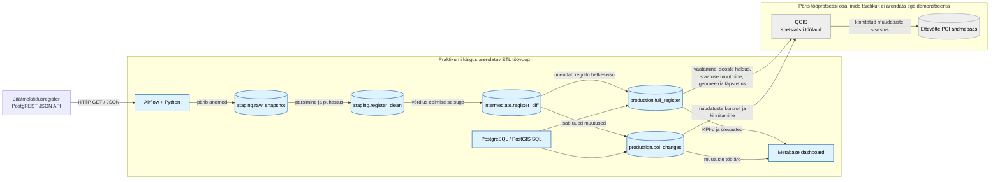
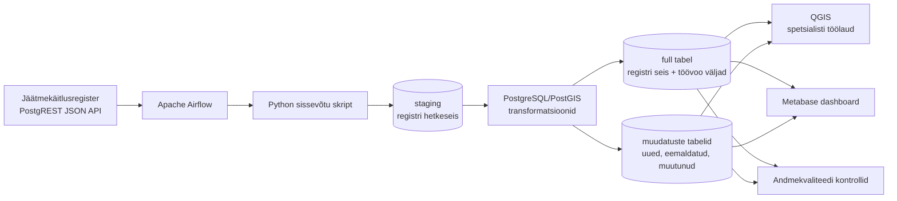
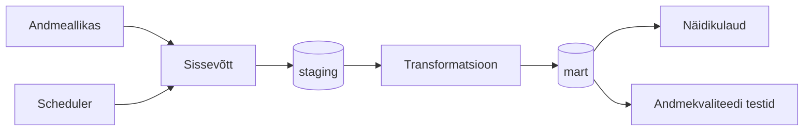

# Arhitektuur

## Äriküsimus

Ärivajadus on hoida jäätmekäitlusregistri põhised huvipunktide andmed ettevõtte POI andmebaasis maksimaalselt ajakohasena võimalikult vähese käsitööga. Lahendus peab lisaks sisestusvamis muudatuste ette valmistamisele andma ülevaate nende käsitlemise seisust, et spetsialist saaks hinnata töömahtu, andmete ajakohasust ja andmehoolduse prioriteete.

## Mõõdikud

1. **Lahendamata muudatuste arv ja osakaal**  
Näitab, mitu jäätmekäitlusregistri objekti on tuvastatud POI andmebaasi jaoks uue, muutunud või eemaldatud objektina, kuid ei ole veel sihtandmebaasis käsitletud.

2. **Lahendamata muudatuste jaotus tüübi järgi**  
Näitab, kas lahendamata muudatused on seotud lisandunud objektide, eemaldatud objektide, atribuudimuutuste või asukohamuutustega.

3. **Lahendamata muudatuste ruumiline paiknemine**  
Näitab kaardil, kus lahendamata muudatused paiknevad, et spetsialist saaks hinnata töö piirkondlikku jaotust ja prioriteetsust.

## Andmeallikad

Keskkonnaregister avaandmed:
https://keskkonnaandmed.envir.ee/f_jkkregister_curr
Püü täpsustab milline(millsed) tabelid
ilmselt sobiks see kõige paremini: f_jkkregister_curr (Jäätmekäitluskohtade register)
https://keskkonnaandmed.envir.ee/f_jkkregister_curr

| Allikas | Tüüp | Ajas muutuv? | Roll |
|---------|------|--------------|------|
| Jäätmekäitlusregister | Avalik PostgREST/JSON API | Jah, registriandmed uuenevad jooksvalt | Peamine andmeallikas, kust võetakse jäätmekäitlusega seotud objektide hetkeseis |
| algne POI seoste tabel | Ühekordne algseadistuse tabel CSV formaadis | Ei, staatiline | Aitab esmakordsel andmevoo loomisel siduda olemasolevad registriobjektid ettevõtte POI andmebaasi objektidega |

## Andmevoog

Esialgsed arhitektuuri mõtted:
- Apache AirFlow
- PostgreSQL, funktsioonid/protseduurid seal
- Metabase

## Andmevoog

> Täpsusta diagrammi vastavalt oma projektile — lisa rohkem andmeallikaid, mudeleid või teenuseid.

## Andmebaasi kihid

| Kiht | Roll |
|------|------|
| `staging` | Hoiab allika andmeid töötlemata kujul. |
| `mart` | Hoiab transformeeritud ja ärilogikat sisaldavaid tabeleid. |

## Tööjaotus

| Roll | Vastutus | Täitja |
|------|----------|--------|
| Andmeallika omanik | Kirjutab sissevõtu loogika, hoiab API-t töös | [Nimi] |
| Transformatsioonide omanik | Kirjutab mart kihi mudelid ja mõõdikute arvutuse | [Nimi] |
| Kvaliteedi omanik | Kirjutab testid ja vaatab läbi ebaõnnestunud kontrollid | [Nimi] |
| Näidikulaua omanik | Ehitab näidikulaua ja seob selle äriküsimusega | [Nimi] |

## Riskid

| Risk | Mõju | Maandus |
|------|------|---------|
| [Risk 1 — näiteks: API ei vasta] | [Mis juhtub?] | [Kuidas maandad?] |
| [Risk 2] | [Mis juhtub?] | [Kuidas maandad?] |
| [Risk 3] | [Mis juhtub?] | [Kuidas maandad?] |

## Privaatsus ja turve

[Kirjelda, millised isiku- või tundlikud andmed teie projektis esinevad (kui üldse) ja kuidas neid kaitsete. Isikuandmed peavad olema anonümiseeritud. Andmebaasi paroolid peavad tulema `.env` failist.]
